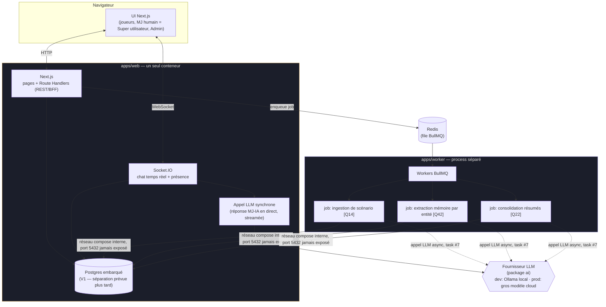

# Architecture — SuperDiscoGM

Retour à [l'index](../index.md) · [spec technique](spec.md).

Vue d'ensemble des composants décidés dans `spec.md`, et de comment ils s'articulent. À valider avant de poursuivre l'implémentation.

## Pourquoi ce découpage

- **Un seul process pour `web`** (Next.js + Socket.IO sur le même serveur HTTP custom) : évite de partager l'auth/les cookies entre deux origines séparées. Voir `spec.md` § Stack technique pour la justification complète (challengée avec Philippe avant de coder).
- **Postgres embarqué dans `web`** (`docker-entrypoint.sh` gère init/migrations/seed avant de démarrer Next.js) : choix explicite et temporaire de Philippe pour la simplicité d'un seul conteneur, au prix de la séparation de cycle de vie DB/appli. `worker` s'y connecte par le réseau compose interne (host `web`), le port 5432 n'est jamais exposé à l'extérieur. **Séparation en service dédié prévue plus tard** ("V25" — repère volontairement lointain).
- **`worker` séparé** : ne porte que ce qui est *explicitement* asynchrone dans la spec fonctionnelle — l'ingestion de scénario, l'extraction mémoire, la consolidation de résumés. **La réponse du MJ-IA en direct dans le chat ne passe jamais par une queue** : elle doit rester synchrone/streamée pour ne pas casser le rythme de jeu.
- **`packages/db`** : schéma Prisma partagé, source unique de vérité du modèle de données pour `web` et `worker`. Migrations versionnées (équivalent Flyway) appliquées via `prisma migrate deploy` au démarrage du conteneur `web` — jamais `migrate dev` en dehors du poste de dev.
- **`packages/jobs`** : contrats partagés (noms de queue + types de payload) entre le producteur (`web`, qui enqueue) et le consommateur (`worker`) — évite une désynchronisation silencieuse entre les deux process.
- **Confidentialité du party split [Q26]** : appliquée côté serveur dans `socket.ts` — un message privé est émis uniquement vers les rooms `user:<id>` des destinataires autorisés, jamais diffusé puis filtré côté client.

## Flux clés

1. **Tour de jeu normal** : joueur → Socket.IO → MJ-IA génère la réponse (appel LLM synchrone, streamé) → diffusion (room `party:x` publique, ou rooms `user:x` ciblées si aparté privé) → persistance `Message` en DB.
2. **Ingestion de scénario** : Super utilisateur lance l'analyse → `web` enqueue un job `scenario-ingestion` → `worker` le consomme, appelle le LLM (task #7, pas encore câblé), écrit les `Phase`, notifie.
3. **Mémoire par entité** : après un échange marquant → job `entity-memory-extraction` → `worker` met à jour `EntityMemory` + `EntityMemoryIndexEntry`.
4. **Résumés hiérarchiques** : job `summary-consolidation` → `worker` met à jour `Summary` (niveau SESSION / ARC / CAMPAIGN).

## Ce qui est déjà scaffoldé vs pas encore

| Composant | État |
|---|---|
| `apps/web` — Next.js + serveur custom + Socket.IO | ✅ scaffoldé, testé (boot + HTTP 200) |
| `packages/db` — schéma Prisma complet + migration initiale | ✅ migration `init` générée et validée contre une vraie DB |
| `apps/worker` — 3 workers BullMQ | 🚧 scaffoldé avec des stubs (pas d'appel LLM réel), connexion DB/Redis validée |
| `packages/jobs` — contrats de queue partagés | ✅ scaffoldé |
| Docker Compose (web avec Postgres embarqué, worker, redis, caddy, ollama dev) | ✅ **validé bout en bout** : build, migrations auto (équiv. Flyway), seed, page lisant la DB au runtime, healthcheck, worker connecté |
| Auth.js v5 | ❌ pas commencé |
| Abstraction LLM multi-fournisseurs (`ai`) | ❌ pas commencé — tout ce qui touche au LLM est un stub pour l'instant |
| Pages réelles (portage de la maquette en composants React) | ❌ pas commencé |
