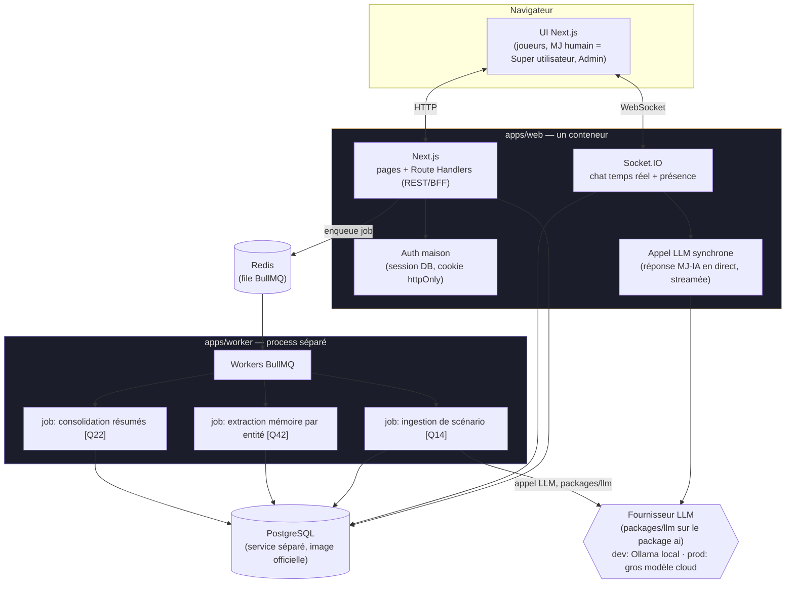

# Architecture — SuperDiscoGM

Retour à [l'index](../index.md) · [spec technique](spec.md).

Vue d'ensemble des composants décidés dans `spec.md`, et de comment ils s'articulent. À valider avant de poursuivre l'implémentation.

## Pourquoi ce découpage

- **Un seul process pour `web`** (Next.js + Socket.IO sur le même serveur HTTP custom) : évite de partager l'auth/les cookies entre deux origines séparées. Voir `spec.md` § Stack technique pour la justification complète (challengée avec Philippe avant de coder).
- **Postgres en service séparé** (image officielle `postgres:16-alpine`, `migrate` en conteneur one-shot dédié). *Un temps embarqué dans `web` pour la simplicité — abandonné : initdb au premier démarrage rendait le boot du conteneur trop lent en pratique, séparé dès que le problème a été observé.*
- **`worker` séparé** : ne porte que ce qui est *explicitement* asynchrone dans la spec fonctionnelle — l'ingestion de scénario, l'extraction mémoire, la consolidation de résumés. **La réponse du MJ-IA en direct dans le chat ne passe jamais par une queue** : elle doit rester synchrone/streamée pour ne pas casser le rythme de jeu.
- **Auth maison, pas de lib tierce** : next-auth v5 écarté après audit (beta depuis fin 2023, cadence de release en ralentissement net). Session opaque stockée en DB (`Session.tokenHash`), cookie httpOnly — révocation triviale, pas de JWT à gérer. Garde léger dans `proxy.ts` (présence du cookie), vérification authoritative systématique dans chaque page/route via `getCurrentUser()`.
- **`packages/db`** : schéma Prisma 7 partagé (driver adapter `@prisma/adapter-pg` obligatoire depuis la v7), source unique de vérité du modèle de données pour `web` et `worker`. Migrations versionnées (équivalent Flyway) appliquées par le conteneur `migrate` — jamais `migrate dev` en dehors du poste de dev.
- **`packages/jobs`** : contrats partagés (noms de queue + types de payload) entre le producteur (`web`, qui enqueue) et le consommateur (`worker`) — évite une désynchronisation silencieuse entre les deux process.
- **`packages/llm`** : abstraction multi-fournisseurs (Anthropic/OpenAI/Ollama) au-dessus du package `ai`, avec un outil `roll_dice` déterministe comme premier point d'extension pour le tool-calling obligatoire (dés, moteur de règles, fiche perso — jamais improvisé en texte libre par le modèle).
- **Confidentialité du party split [Q26]** : appliquée côté serveur dans `socket.ts` — un message privé est émis uniquement vers les rooms `user:<id>` des destinataires autorisés, jamais diffusé puis filtré côté client.

## Flux clés

1. **Connexion** : POST `/api/auth/login` → vérifie le mot de passe (bcrypt) → crée une `Session` en DB → cookie httpOnly. `proxy.ts` redirige vers `/login` si le cookie est absent ; chaque page revérifie en DB via `getCurrentUser()`.
2. **Tour de jeu normal** : joueur → Socket.IO → MJ-IA génère la réponse (appel LLM synchrone, streamé) → diffusion (room `party:x` publique, ou rooms `user:x` ciblées si aparté privé) → persistance `Message` en DB.
3. **Ingestion de scénario** : Super utilisateur lance l'analyse → `web` enqueue un job `scenario-ingestion` → `worker` le consomme, appelle le LLM via `packages/llm` (`generateObject`), écrit les `Phase` avec métadonnées complètes, notifie.
4. **Mémoire par entité** : après un échange marquant → job `entity-memory-extraction` → `worker` met à jour `EntityMemory` + `EntityMemoryIndexEntry`.
5. **Résumés hiérarchiques** : job `summary-consolidation` → `worker` met à jour `Summary` (niveau SESSION / ARC / CAMPAIGN).

## Ce qui est déjà scaffoldé vs pas encore

| Composant | État |
|---|---|
| `apps/web` — Next.js + serveur custom + Socket.IO | ✅ scaffoldé, testé (boot + HTTP 200) |
| `packages/db` — schéma Prisma 7 + driver adapter + migrations | ✅ 3 migrations générées et validées contre une vraie DB |
| Auth maison (session DB, login/logout/invitation) | ✅ **validé bout en bout** : redirection, rejet mauvais mot de passe, cookie, page authentifiée, déconnexion |
| `apps/worker` — 3 workers BullMQ | 🚧 `ingestion.ts` branché sur un vrai appel LLM ; `entityMemory.ts`/`summaries.ts` encore en stub |
| `packages/jobs` — contrats de queue partagés | ✅ scaffoldé |
| `packages/llm` — abstraction multi-fournisseurs + outil `roll_dice` | ✅ scaffoldé, branché dans `ingestion.ts` — pas encore testé contre un vrai Ollama qui tourne |
| Docker Compose (postgres, migrate, web, worker, redis, caddy, ollama dev) | ✅ **validé bout en bout**, démarrage ~5s après build (Postgres séparé, pas embarqué) |
| Pages réelles (portage de la maquette en composants React) | ❌ pas commencé — seules login/invite/accueil existent, en style minimal fonctionnel |
